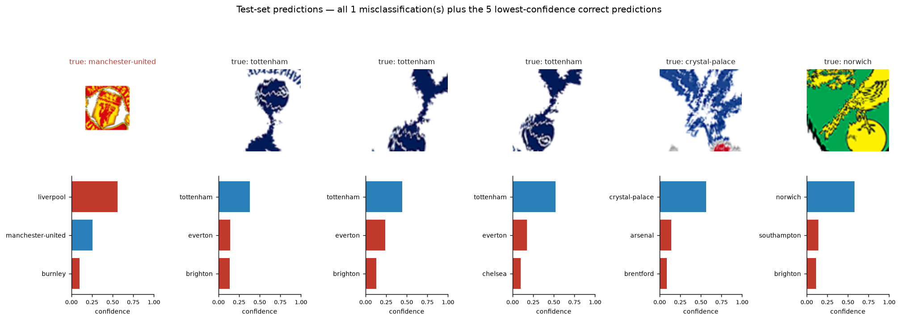
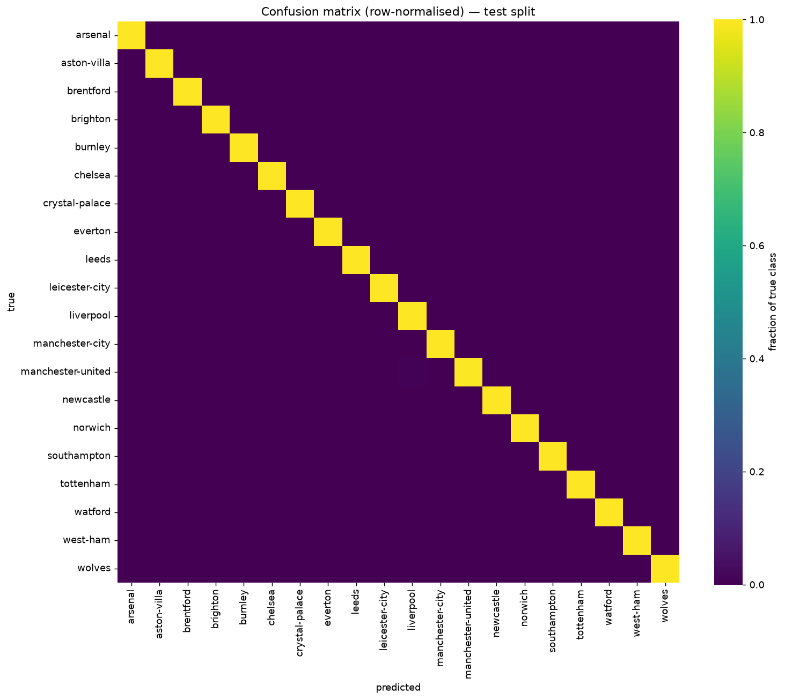

# Premier League Crest Classifier

Identify which of 20 Premier League clubs a crest belongs to. EfficientNet-B0
transfer learning in PyTorch, with a Gradio drag-and-drop demo.

**99.97% top-1 accuracy, 100% top-3** on a 3,000-image held-out test set.



*The model's single error (left, red) plus its five least-confident correct
predictions. Uncertainty shows up on extreme crops, not on whole crests.*

## Try it

The trained model is included in this repo, so you don't need the dataset or a GPU:

```bash
git clone https://github.com/igarten-CMU/club-logo-classifier.git
cd club-logo-classifier
python3 -m venv pytorch_env && source pytorch_env/bin/activate
pip install -r requirements.txt
python app.py
```

Open <http://127.0.0.1:7860> and drop in a crest image, or click one of the
built-in examples. `python app.py --share` creates a temporary public link.

## How it works

An EfficientNet-B0 pretrained on ImageNet is frozen and used as a fixed feature
extractor; only a new 20-class output layer is trained — 25,620 parameters out of
4 million. Training takes 6.5 minutes on Apple Silicon.

| | |
|---|---|
| Model | `efficientnet_b0(weights=DEFAULT)`, backbone frozen |
| Loss | `CrossEntropyLoss` |
| Optimiser | `AdamW(lr=1e-3, weight_decay=1e-2)` |
| Schedule | `CosineAnnealingLR(T_max=12)` |
| Data | 20,000 images, 1,000 per club, split 70/15/15 |

The source images are transparent-background PNGs. Each crest is composited onto
a **random background colour during training** so the model can't use the backdrop
as a shortcut, then augmented with crops, rotations and colour jitter. Horizontal
flips are disabled — crests contain text.

## Results

The only mistake across 3,000 test images is a heavily cropped Manchester United
crest predicted as Liverpool — both are predominantly red and white. Top-3
accuracy is perfect.



**A note on the accuracy number.** The dataset's 1,000 images per club are
augmented variants of a smaller set of source renders, so a random split scatters
near-identical images across train and test and inflates the score. To check this,
[`fingerprint.py`](fingerprint.py) clusters near-duplicates and `--grouped` splits
by cluster so no variants straddle splits. Accuracy didn't drop — it went from
99.90% to 99.97%. Separating 20 visually distinct logos is simply an easy task for
pretrained features. Real jersey photos would be a much harder benchmark.

## Training from scratch

Requires a Kaggle account. Create a token at <https://www.kaggle.com/settings> → API:

```bash
mkdir -p ~/.kaggle && printf '{"username":"YOUR_USERNAME","key":"YOUR_KEY"}' > ~/.kaggle/kaggle.json && chmod 600 ~/.kaggle/kaggle.json
kaggle datasets download -d alexteboul/english-premier-league-logo-detection-20k-images -p data/raw --unzip
python train.py --epochs 12 --grouped --checkpoint checkpoints/best_grouped.pt --history checkpoints/history_grouped.json
python evaluate.py --checkpoint checkpoints/best_grouped.pt --history checkpoints/history_grouped.json --assets assets_grouped
```

## Files

```
data.py                transforms, alpha compositing, data splits
train.py               training loop
evaluate.py            accuracy, confusion matrix, curves
fingerprint.py         near-duplicate detection
sample_predictions.py  prediction grid
app.py                 Gradio demo
```

## Dataset

[English Premier League Logo Detection](https://www.kaggle.com/datasets/alexteboul/english-premier-league-logo-detection-20k-images)
by Alex Teboul, CC0-1.0. 20 clubs from the 2021/22 season.
